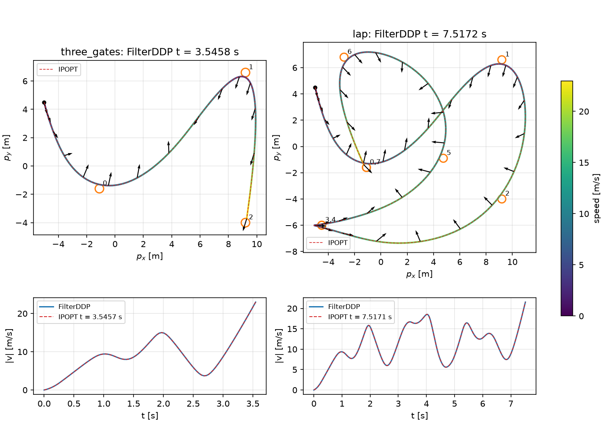

# Time-Optimal Quadrotor Waypoint Flight

The CPC problem of Foehn, Romero, and Scaramuzza (2021, ["Time-Optimal Planning for Quadrotor
Waypoint Flight"](https://doi.org/10.1126/scirobotics.abh1221)) solved with FILTERDDP. The
reference is the unmodified CPC planner of
[rpg_time_optimal](https://github.com/uzh-rpg/rpg_time_optimal) solved with IPOPT. Both solvers
start from the planner's own initial guess.

The OCP matches CPC's NLP stage by stage, with one change: **the progress end condition
$`\mu_N=0`$ is a terminal cost** $`\tfrac{w}{2}\lVert\mu_N\rVert^2`$ with $`w=10^3`$, because
FILTERDDP has no terminal constraints. The dynamics are lifted: the next quadrotor state is a
control, and the RK4 step is a stage equality.



The top-down paths are coloured by speed, with the thrust direction every sixth node and the
0.3 m waypoint tolerances; IPOPT's solution is dashed. The lower panels show the speed.

## Sources and revisions

| Source | Role | Revision |
| --- | --- | --- |
| [Foehn, Romero, Scaramuzza 2021](https://doi.org/10.1126/scirobotics.abh1221) | CPC problem | Science Robotics 6(56) |
| [rpg_time_optimal](https://github.com/uzh-rpg/rpg_time_optimal) | Quadrotor (`quads/quad.yaml`), CPC NLP, initial guess, IPOPT reference; the tracks are the first gates of its `tracks/track.yaml` | [`f5541b6`](https://github.com/uzh-rpg/rpg_time_optimal/tree/f5541b6d9d3dee563e01a64ec1994b8ed6c0076c) |
| [mingu6/acados, branch `filterddp`](https://github.com/mingu6/acados/tree/filterddp) | FILTERDDP NLP solver in acados | [`da2bd8bd0`](https://github.com/mingu6/acados/commit/da2bd8bd0) |
| [CasADi](https://github.com/casadi/casadi) | Expressions, code generation, IPOPT | 3.7.2 |

## Run

```bash
conda env create -f environment.yml && conda activate waypoint-flight-acados
pip install --no-deps -e ../../../../interfaces/acados_template
./reproduce.sh
```

`reproduce.sh` uses this acados tree (override it with `FILTERDDP_ACADOS_DIR`). It clones
rpg_time_optimal at `f5541b6` into `data/` unless `RPG_TIME_OPTIMAL_DIR` names a checkout, solves
both tracks with FILTERDDP and IPOPT, and writes `output/<track>/` and `output/trajectories.png`.
The FILTERDDP settings are $`\mu_0=10^{-2}`$ and $`\kappa_1=\kappa_2=10^{-4}`$ (`filterddp_mu_init`,
`filterddp_kappa_1/2`); the defaults, 1 and $`10^{-2}`$, push the progress variables off the
initial guess.

## Results

30 nodes per gate, FILTERDDP `tol = 1e-6`, IPOPT `tol = 1e-9`, single thread. FILTERDDP times
exclude code generation (about 8 s).

| Track | Waypoints / N | IPOPT | FILTERDDP |
| --- | --- | --- | --- |
| `three_gates` | 3 / 90 | $`t=3.545744`$ s, 307 it, 15 s | $`t=3.545794`$ s, 253 it, 0.7 s |
| `lap` (first 7 gates, back to gate 0) | 8 / 240 | $`t=7.517082`$ s, 938 it, 173 s | $`t=7.517248`$ s, 777 it, 11 s |

The remaining gaps come from the inexact penalty ($`\mu_N\approx1.4\cdot10^{-5}`$ and
$`3\cdot10^{-5}`$) and the barrier floor.
